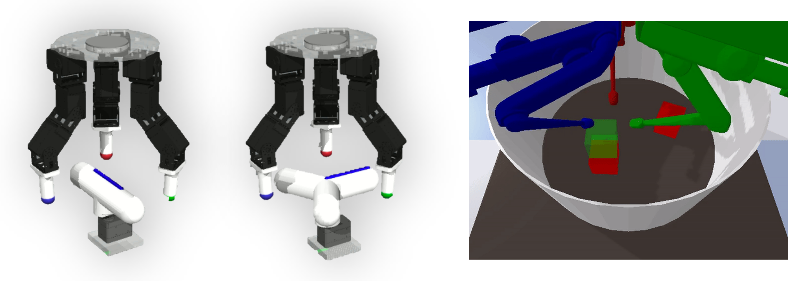

# BTDM: Benchmarks for Transferable Dexterous Manipulation
 BTDM includes two series of multi-finger manipulation platform, [ROBEL D'Claw](https://github.com/google-research/robel) and [TriFinger](https://sites.google.com/view/trifinger/home-page)

## Robot Platforms
|  |
:----------------------:
| Robots Platforms: ROBEL D’Claw (left and middle) and TriFinger (right) |

## 1. Env list
> DClawTurnFixedDx  (x: 0-14)
> 
> DClawScrewFixedDx (x: 0-14)
> 
> DClawTurnFixedDxTS-v0 (x:0-14) mount touch sensor for each finger-tip.
> 
> DClawScrewFixedDxTS-v0 (x:0-14) mount touch sensor for each finger-tip.
> 
> TriFinger pushing/picking/stacking...

## 2. TODO
more details about environments.

## Disclaimer
Our environments are based on: 
1. [ROBEL: Robotics Benchmarks for Learning](https://github.com/google-research/robel).
2. [CausalWorld](https://github.com/rr-learning/CausalWorld)
